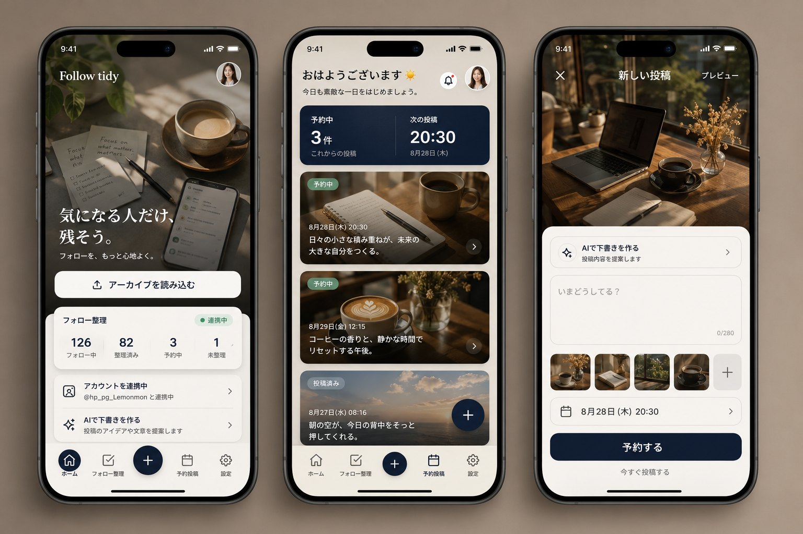

<!-- 出典: 2026-08-25 に受け取った要件定義書 (Follow_tidy_UI_redesign_requirements.docx) を
     Markdownへ書き起こしたもの。実装の判断根拠として置いている。
     以前の版 (REDESIGN_INSTRUCTIONS.md) は、この要件で置き換わっている。 -->

# Follow tidy UIリデザイン要件定義書

PRODUCT / UI SPECIFICATION — Claude Code実装用 / デザイン変更のみ・既存機能維持

| 文書バージョン | 1.0 |
| --- | --- |
| 作成日 | 2026年8月25日 |
| 対象 | Follow tidy モバイルWebアプリ / PWA |
| 優先方針 | 写真を活かした落ち着いた高級感 + 既存動作の完全維持 |

図1. 採用するデザイン方向（ホーム / 予約投稿 / 新規投稿）

## 0. Claude Codeへの最初の指示

> **最重要** — これは全面リニューアルではなく、既存のデータ処理・X連携・予約投稿ロジックを維持したUIリデザインである。既存機能を削除・置換・簡略化しない。

実装開始時は、まずリポジトリを調査し、使用中のフレームワーク、ルーティング、状態管理、スタイル方式、コンポーネント構造を把握する。その後、既存方式に沿って最小限の差分で実装する。技術スタックを勝手に変更しない。

現行の全画面・コンポーネント・主要ユーザーフローを一覧化する。

既存のイベント処理、API呼び出し、IndexedDB、X連携、予約投稿処理を変更せず、UI層を中心に改修する。

共通デザイントークンと共通コンポーネントを先に整備する。

ホーム → 予約投稿 → 新規投稿 → フォロー整理 → 設定の順で実装する。

各画面で既存の操作が同じ結果になることを確認し、レスポンシブ・アクセシビリティ・主要状態を検証する。

## 1. プロジェクト概要

### 1.1 目的

現在の白・黒・グレー中心で余白が大きいUIを、写真とレイヤー表現を活かした温かく洗練されたUIへ変更する。

参考デザインの「大きな写真」「写真上の文字」「白い角丸カード」「落ち着いたベージュ〜ネイビー」をFollow tidyの用途に合わせて再構成する。

フォロー整理や予約投稿という実用機能を、迷わず操作できる情報設計と視覚階層で提示する。

### 1.2 対象範囲

ホーム / Xアーカイブ読み込み

フォロー整理

予約投稿一覧

新規投稿・AI下書き・画像追加・日時指定

設定 / プライバシー / アーカイブ再読み込み / 更新通知 / データ削除

下部固定ナビゲーション、ヘッダー、プロフィール導線、共通カード・ボタン・状態表示

### 1.3 対象外

X連携方式、認証方式、API仕様、DB構造、予約実行ロジックの作り直し

フォロー解除判定ロジック、アーカイブ解析ロジック、データ保持方針の変更

不動産・ホテル・旅行アプリの機能や文言の流用

新規機能の追加。必要に見える場合も、まず既存機能への視覚的な再配置として扱う

### 1.4 実装前提

画面キャプチャはiPhone幅を基準とするが、実装はモバイルWeb/PWAとして320〜480px幅に対応する。

既存リポジトリの技術構成を優先し、ライブラリ追加は本当に必要な場合だけ行う。

写真素材が未確定の場合は差し替え可能なローカル仮画像を使用し、外部URLへの直リンクはしない。

## 2. デザインコンセプト

### 2.1 キーワード

> **方向性** — Calm editorial / Warm premium / Photo first / Practical / Trustworthy

落ち着き：余白は確保するが、背景色・写真・カードの重なりで寂しく見せない。

編集的：重要な見出しや投稿文を写真上に重ね、コンテンツの世界観を作る。

実用的：装飾より操作性を優先し、数値・状態・主要CTAはすぐ判別できる。

一貫性：角丸、影、余白、アイコン、文字サイズ、状態色を全画面で統一する。

### 2.2 ビジュアルルール

背景を純白にしない。基本背景はウォームアイボリーまたは淡いサンド色とする。

画面上部または主要カードに写真を配置する。写真が多すぎて情報が読めなくならないよう、1画面の主役写真は原則1〜3枚とする。

写真上の文字には下部グラデーションまたは半透明オーバーレイを敷き、コントラスト比を確保する。

白いカードは背景から浮く程度の柔らかい影と細い境界線を使う。強い黒影は使わない。

強調色はディープネイビー、状態色はセージグリーン、危険操作のみ赤を使う。

### 2.3 禁止事項

白背景だけで画面の大半を占める構成

紫・ネオン・派手なグラデーション、過度なグラスモーフィズム

不動産価格、ホテル名、家の写真など参考画像の内容そのものの流用

可読性を損なう細すぎる文字、装飾目的の過剰な明朝体、写真上の低コントラスト文字

操作に必要なテキストをアイコンだけに置き換えること

## 3. デザイントークン

| トークン | 指定値 / 用途 |
| --- | --- |
| 背景 / Warm Ivory | #F4F0EA（ページ全体） |
| Surface / Ivory | #FBF9F5（カード・ボトムシート） |
| Primary / Ink Navy | #11213D（主要CTA・選択状態） |
| Primary Hover | #1D2E4F |
| Text / Ink | #1B1A18 |
| Text / Muted | #6F6B66 |
| Border | #DDD7CF |
| Status / Sage | #4D8A70、背景 #E5F0EB |
| Danger | #B44C4C |
| Accent / Warm Gold | #A77C45（限定使用） |

### 3.1 タイポグラフィ

本文・UI：既存フォントを優先。未指定の場合は system-ui, -apple-system, BlinkMacSystemFont, "Hiragino Sans", "Noto Sans JP", sans-serif。

写真上の大見出しのみ、必要に応じて "Noto Serif JP" / 游明朝系を使用可能。UI本文に明朝体は使わない。

画面タイトル 24〜28px / 700、セクション見出し 18〜20px / 700、本文 14〜16px / 400〜500、補助 12〜13px。

数値は tabular-nums を有効化し、カード内で桁位置を揃える。

### 3.2 形状・余白・影

| 角丸 | Hero 24px / Card 20px / Input 16px / Pill 9999px / Modal top 28px |
| --- | --- |
| 基準余白 | 4pxグリッド。画面左右20px、セクション間24px、カード内16〜20px |
| タップ領域 | 最小44×44px |
| カード影 | 0 8px 24px rgba(17,33,61,0.08) |
| 浮遊CTA影 | 0 10px 28px rgba(17,33,61,0.18) |
| 境界線 | 1px solid #DDD7CF |
| 遷移 | 150〜220ms、ease-out。派手なバウンスは禁止 |

### 3.3 画像仕様

写真は暖色寄り、自然光、木・紙・コーヒー・デスク・スマートフォンなど、SNS運用と相性の良い生活感のある素材を選ぶ。

object-fit: cover。Heroは16:10〜4:3、投稿カードは16:9、サムネイルは1:1を基本とする。

文字を重ねる写真には、下から上へ rgba(10,18,32,.76) → transparent のグラデーションを必ず追加する。

ユーザー投稿に画像がない場合、無関係なストック写真を勝手に追加しない。テキスト用の温かいグラデーションカードを使用する。

装飾画像はローカル配信・圧縮済みWebP/AVIFを推奨。LCP候補だけ優先読み込みし、一覧画像は遅延読み込みする。

## 4. 共通レイアウト・ナビゲーション

### 4.1 ビューポート

基準デザイン幅：390px。対応範囲：320〜480px。480px超ではアプリ本体を最大480pxで中央配置する。

iOSのsafe-area-inset-top / bottomを考慮し、下部ナビがホームインジケータと重ならないようにする。

コンテンツ下端には下部ナビ分 + 24px以上の余白を確保する。

### 4.2 ヘッダー

左に「Follow tidy」、右にプロフィールアバター。ヘッダー高は56〜64px。

ホームHeroと一体化する場合は写真上に白文字で重ねてよい。スクロール後は半透明のウォームアイボリー背景を付ける。

プロフィールアイコンは44px以上のタップ領域を持ち、既存のアカウント画面・操作につなぐ。

### 4.3 下部固定ナビゲーション

項目：ホーム / フォロー整理 / 中央の新規投稿 / 予約投稿 / 設定。順序は変更しない。

高さは72px + safe area。背景はrgba(251,249,245,.94) + backdrop-filterを使用可能。上端に薄い境界線。

通常項目はアイコン24px + ラベル11〜12px。選択項目はネイビー、非選択は#77736F。

中央の＋は56px円形、ネイビー背景、白アイコン、上方向へ12px浮かせる。

選択状態は色だけでなく、背景ピルまたは太さの変化でも示す。

### 4.4 共通コンポーネント

| コンポーネント | 仕様 |
| --- | --- |
| PhotoHero | 写真 + グラデーション + 見出し + 補助文 + CTA。高さ280〜360px。 |
| SurfaceCard | 白〜アイボリー、角丸20px、境界線、柔らかい影。 |
| StatusPill | 予約中/投稿済み/連携中/失敗。色だけでなくテキストを表示。 |
| MetricRow | 数値とラベルの組。数値20〜28px、ラベル12px。 |
| PhotoPostCard | 画像 + 日時 + 本文 + 状態。画像なし時はGradientTextCard。 |
| BottomSheet | 上角28px。ドラッグバー、閉じる、スクロール、safe area対応。 |
| PrimaryButton | 高さ52〜56px、ネイビー、白文字、角丸16px。 |
| SecondaryButton | アイボリー/透明、1px境界線、ネイビー文字。 |

## 5. 画面別要件

### 5.1. ホーム

> **目的** — 最初の1画面でアプリの価値、アーカイブ読み込み、整理状況、アカウント状態を理解できること。

上部にデスク・スマートフォン・ノート等の落ち着いた写真を使ったHeroを配置する。

Hero内の見出しは「気になる人だけ、残そう。」、補助文は「フォローを、もっと心地よく。」とする。

主CTA「アーカイブを読み込む」を写真上の白ボタンとして配置し、既存ZIP選択処理へ接続する。ドラッグ&ドロップ可能な環境では既存処理も維持する。

Hero下部に「フォロー整理」サマリーカードを重ね、フォロー中・整理済み・予約中・未整理の既存値を表示する。存在しない値は勝手に生成せず、取得可能な項目だけ表示する。

その下に「アカウントを連携中」「AIで下書きを作る」などの既存導線をSurfaceCardでまとめる。

説明文は長文をそのまま中央配置せず、「ローカル解析」「外部送信なし」等の短い信頼ラベルと詳細リンクに整理する。

#### 必要な状態

未読込：CTAを主役にし、統計カードは非表示または0表示ではなく案内表示。

読込中：Hero CTA内に進捗・スピナー、二重実行不可。

読込済み：サマリー値と最終読込日時を表示。

読込失敗：原因と再試行をカード内に表示。レイアウトを崩さない。

### 5.2. フォロー整理

> **目的** — 大量のアカウントを「確認・保護・解除候補」に素早く分類できること。

画面上部に短い写真帯または暖色のビジュアルヘッダーを配置し、タイトル「フォロー整理」と残件数を重ねる。

フィルターは横スクロール可能なピル：「すべて」「非相互」「未整理」「保護」「解除済み」。既存分類名が異なる場合は既存語を優先する。

各アカウントはアバター、表示名、@ID、必要な既存指標、現在状態、主要アクションを1カードにまとめる。

「残す/保護」はセージ系、「解除候補/解除」は危険色を限定使用する。破壊的操作は確認ステップを維持する。

カードのスワイプ操作を新設する場合でも、同じ操作を行える可視ボタンを必ず残す。

大量件数では仮想化または段階読み込みを検討し、画像遅延読み込みとスクロール位置維持を行う。

#### 必要な状態

アーカイブ未読込：ホームと同じ読み込み導線へ案内。

0件：完了メッセージと別フィルターへの導線。

処理中/失敗：対象カード単位で表示し、全画面を操作不能にしない。

### 5.3. 予約投稿一覧

> **目的** — 予約状況と次の投稿を一目で把握し、投稿の確認・編集・削除へ進めること。

冒頭に挨拶または画面タイトルとアバターを置く。不要な個人名はハードコードしない。

ネイビーのサマリーカードに「予約中 N件」「次の投稿 HH:mm」を大きく表示する。データがない場合は「なし」。

投稿カードは画像付きの場合PhotoPostCard、画像なしの場合GradientTextCardを使用する。画像付きでは日時・本文・状態を下部グラデーション上に配置する。

状態ピルは「予約中」「下書き」「繰り返し」「投稿済み」「失敗」。既存ステータスに合わせ、意味を変更しない。

フィルターは「すべて / 予約中 / 下書き / 繰り返し / 投稿済み / 失敗」を横スクロールで維持する。

カードタップで詳細/編集。削除はカード上で赤を常時強調しすぎず、詳細またはメニュー内で確認後に実行する。

右下または下部中央に新規投稿CTAを表示し、既存作成フローへ接続する。

#### 必要な状態

0件：温かい背景の空状態 + 「最初の投稿を作る」CTA。

失敗：失敗理由、再試行可否、既存ログ導線を示す。

長文：本文は3〜4行で省略し、詳細で全文表示。

### 5.4. 新規投稿 / 投稿編集

> **目的** — 文章・画像・日時を1つの流れで設定し、AI下書きも自然に利用できること。

スマートフォンでは全画面またはBottomSheetとして表示する。既存のモーダル挙動を壊さない範囲で選択する。

上部に画像プレビューを大きく表示し、タイトル「新しい投稿」を白文字で重ねる。画像未選択時はアプリ所有の落ち着いた仮ビジュアルまたは暖色グラデーションを使用する。

写真に重なる白いBottomSheet内に「AIで下書きを作る」、本文入力、画像サムネイル、日時選択、予約ボタンを縦に配置する。

本文プレースホルダーは「いまどうしてる？」、文字数は既存上限（現状280）を右下に表示する。

画像は1:1サムネイル、削除ボタン、追加枠を表示する。アップロード枚数・形式・容量は既存制約を変更しない。

日時行は「8月28日（木）20:30」のように読みやすく表示し、内部値は既存データ形式を維持する。

主要CTA「予約する」はネイビー。補助操作「今すぐ投稿する」はテキストまたはSecondaryButton。既存機能がない場合は追加しない。

キーボード表示時もCTAと本文が隠れないよう、visual viewport / safe area / scroll into viewを考慮する。

#### 必要な状態

AI生成中：対象エリア内のローディング。本文入力を消さない。

文字数超過：残数を赤表示し、送信不可。

日時不正/過去：行内エラー。

保存中：二重送信不可。成功時は一覧へ反映し、既存の通知方法を使用。

### 5.5. 設定

> **目的** — 情報量が多くても読みやすく、安全性と危険操作の区別が明確であること。

背景はWarm Ivory。セクションごとにSurfaceCardを使い、カード間は16〜20px空ける。

「プライバシー」「アーカイブの再読み込み」「アップデートの通知」「データの削除」を既存順または重要度順で表示する。

各カードには小さなアイコンまたは控えめな写真/テクスチャ帯を使用可能だが、設定画面は写真過多にしない。

長い説明文は見出し、要約、詳細展開に分ける。重要な「外部サーバーへ送信されない」説明は削らない。

データ削除カードのみ赤い境界/ラベルを使い、実行前の確認と影響説明を維持する。

通知設定が未構成の場合は現状理由と必要手順を提示し、動くように見せる偽トグルを置かない。

## 6. 状態・例外・アクセシビリティ

### 6.1 全画面共通状態

Loading：レイアウトと同じ形のスケルトンを使用し、画面中央の大きなスピナーだけにしない。

Empty：何もない理由、次にできる操作、CTAを1セットで示す。

Error：エラー内容をユーザー向けに短く表示し、可能なら再試行。技術詳細は必要に応じて展開。

Success：既存のトースト/通知方式を優先し、必要なら控えめなセージ色で統一。

Offline：ローカルでできる操作と通信が必要な操作を区別する。予約投稿の通信要件に関する既存説明を維持する。

### 6.2 アクセシビリティ

本文と背景はWCAG AA相当のコントラスト。写真上の文字もオーバーレイ込みで確認する。

タップ領域は44×44px以上。アイコンボタンにはaria-labelを設定する。

フォーカスリングを削除しない。キーボード操作、Escapeでモーダルを閉じる、フォーカストラップを実装/維持する。

状態は色のみで伝えず、必ずテキストまたはアイコン形状を併用する。

prefers-reduced-motionでは不要な移動・拡大アニメーションを無効化する。

画像には内容に応じたaltを設定。純装飾画像はalt=""。

### 6.3 パフォーマンス

Hero画像は適切なsrcset/sizesまたはフレームワークの画像最適化機能を使用する。

一覧画像はlazy load。レイアウトシフトを防ぐため幅・高さまたはaspect-ratioを指定する。

既存バンドルに大きなUIライブラリを追加しない。アイコンは既存セットを優先する。

外部画像URLへの依存を避け、画像取得失敗時のフォールバックを用意する。

## 7. 実装方針

### 7.1 既存コード調査

package.json / lockfile / app構成 / routes / components / styles / state / service worker / IndexedDB関連を確認する。

各画面のデータ入力元、イベントハンドラ、API/認証依存、破壊的操作をマッピングする。

UI変更前に主要フローの現状動作を確認し、可能なら既存テストを実行する。

### 7.2 実装順序

CSS変数または既存テーマ機構にデザイントークンを追加する。

Card / Button / Pill / Hero / PostCard / BottomSheet / BottomNavを共通化する。

ホームをリデザインし、ZIP読込フローを回帰確認する。

予約投稿一覧と新規投稿をリデザインし、作成・編集・削除・予約を回帰確認する。

フォロー整理をリデザインし、分類・保護・解除関連を回帰確認する。

設定をリデザインし、通知・再読み込み・削除を回帰確認する。

320/375/390/430/480pxで確認し、キーボード・safe area・長文・0件・エラーを検証する。

### 7.3 ファイル/コンポーネント命名例

実際のディレクトリ構成に合わせること。以下を新規構成として強制しない。

design-tokens.css / theme.ts：色・余白・角丸・影

PhotoHero / SurfaceCard / StatusPill / MetricRow

PhotoPostCard / GradientTextCard / ComposerSheet

BottomNavigation / FloatingComposeButton

### 7.4 画像アセット枠

| 仮アセット名 | 用途 |
| --- | --- |
| home-hero | デスク + スマートフォン + ノート。16:10。 |
| composer-cover | カフェのデスク + PC + コーヒー。4:3。 |
| text-card-fallback | 写真なし投稿用のウォームグラデーション。 |

仮画像は後から一括置換できる場所へまとめ、ライセンス不明の画像をコミットしない。生成モックアップ画像そのものを画面背景として切り出して使用しない。

## 8. 受け入れ基準（Definition of Done）

□ 既存の5ナビゲーション項目と中央＋ボタンが正しい画面へ遷移する。

□ XアーカイブZIPの選択/ドロップ/解析が変更前と同じ条件で動作する。

□ アカウント連携・解除が変更前と同じ結果になる。

□ フォロー整理の一覧・フィルター・保護/解除関連操作が動作する。

□ 予約投稿の作成・編集・削除・一覧フィルター・状態表示が動作する。

□ AI下書き、本文入力、文字数、画像追加、日時指定が動作する。

□ 設定内の再読み込み、通知、データ削除が既存仕様どおり動作する。

□ ホーム、予約投稿、新規投稿には写真が効果的に配置され、写真上の文字が読みやすい。

□ 純白の広い空白面がなく、Warm Ivory背景とカードレイヤーが全画面で統一されている。

□ 320〜480px幅で横スクロール・欠け・ナビ重なりがない。

□ キーボード表示時に投稿入力とCTAが操作できる。

□ Loading / Empty / Error / Successの主要状態が崩れない。

□ タップ領域、aria-label、フォーカス、コントラスト、reduced motionを確認している。

□ 画像の遅延読み込み・サイズ確保が行われ、目立つCLSがない。

□ 既存テストが通り、追加/変更部分に必要なテストが追加されている。

□ スクリーンショットまたは実機確認結果を、画面ごとに提示できる。

## 9. Claude Code貼り付け用・実装指示文

> **使用方法** — 下記の内容と図1をClaude Codeへ渡し、まず調査結果と変更計画を出させてから実装させる。

Follow tidyの既存リポジトリを、この要件定義書と添付モックアップに従ってUIリデザインしてください。最優先条件は「既存機能を一切壊さないこと」です。まずコードベースを調査し、フレームワーク、ルーティング、状態管理、スタイル方式、主要コンポーネント、X連携、IndexedDB、予約投稿、アーカイブ解析の接続箇所を整理してください。技術スタックやデータ構造を勝手に変更せず、UI層を中心に最小差分で実装してください。実装前に変更予定ファイルと手順を提示し、その後に共通デザイントークン、共通コンポーネント、各画面の順で進めてください。写真を多用しますが、不動産・ホテルの内容は流用せず、SNS整理と投稿作成に合うデスク/スマートフォン/ノート/カフェ写真を使います。外部URLへ画像を直リンクせず、差し替え可能なローカルアセットとして扱ってください。各実装後に既存動作、320〜480px、safe area、キーボード表示、空/読込/エラー/成功状態、アクセシビリティを確認してください。不明点があり既存仕様の挙動が変わる可能性がある場合は、推測で実装せず質問してください。

提出物：変更概要 / 変更ファイル一覧 / 実装内容 / 既存仕様を維持した根拠 / テスト結果 / 残課題 / 各画面のスクリーンショット。

## 10. 補足・判断が必要な点

写真素材の最終版は別途差し替え可能とし、初回実装ではレイアウト確認用の仮素材でよい。

画面名やステータス名が実コードと異なる場合、意味を変えずに既存名称を優先する。

モックアップ上の数値（例：予約中3件、次の投稿20:30）は表示例であり、実データを使用する。

モックアップ上のアバター・挨拶・投稿日は表示例。ユーザー情報や現在日時から生成し、ハードコードしない。

要件と既存仕様が衝突する場合は、既存機能維持を優先し、UI側の代替案を提示する。
